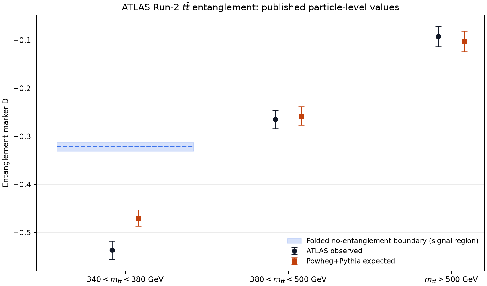
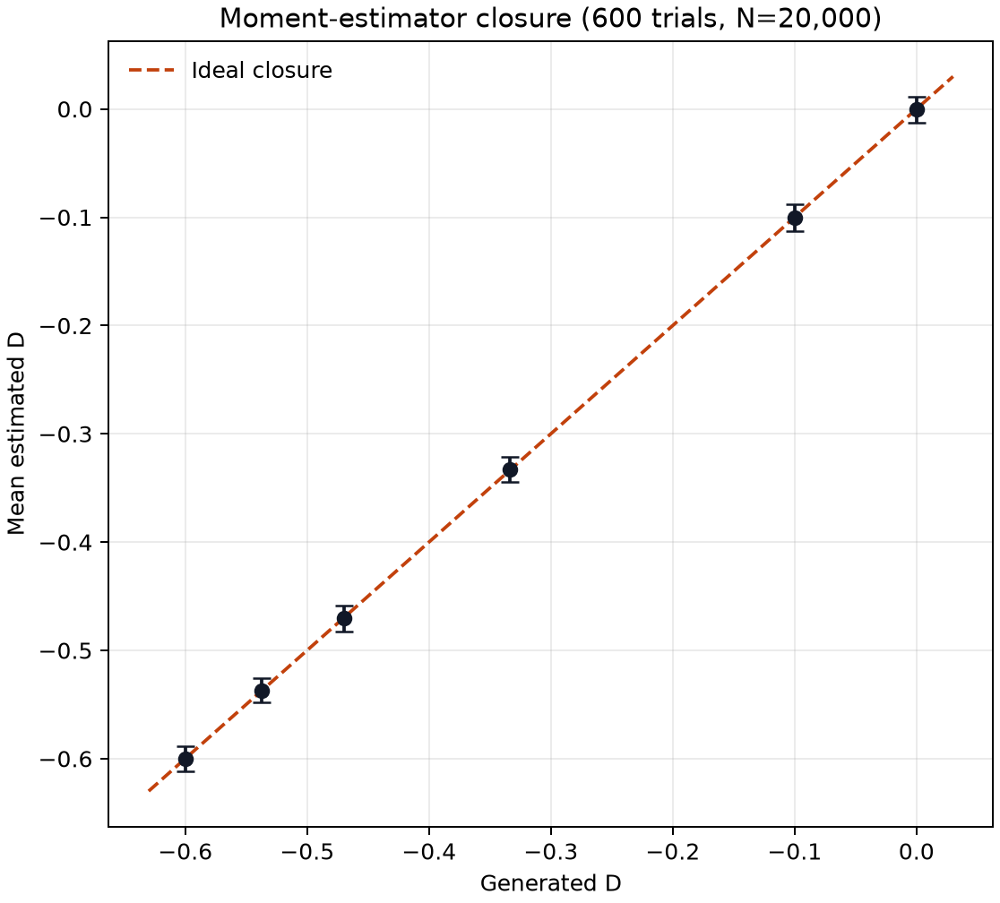
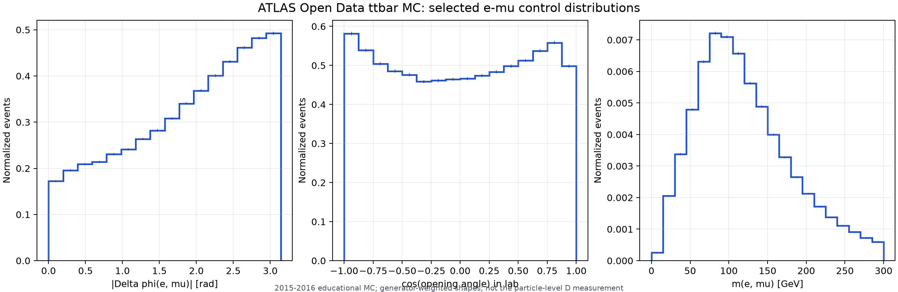
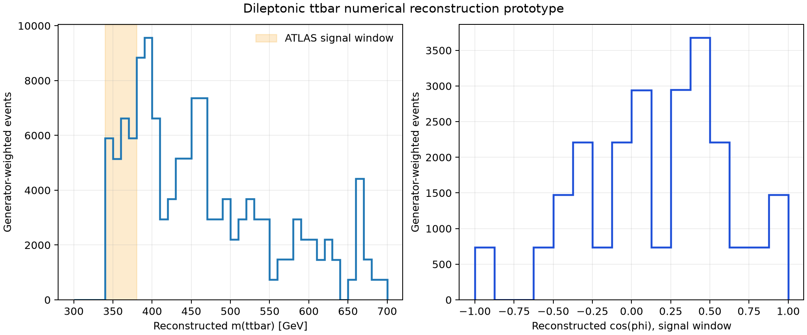

# Borrador: entrelazamiento cuántico en pares top-antitop de ATLAS

> [!CAUTION]
> **Repositorio privado, no revisado por su propietario.** Este proyecto fue
> construido con asistencia sustancial de **GPT-5.6 Work (Codex)** y José
> Ignacio Rosas todavía no ha revisado ni validado el código, las decisiones
> físicas o las conclusiones. No debe presentarse como un análisis científico
> propio terminado, incluirse todavía en un CV ni citarse como una reproducción
> validada. Véanse [AI_ASSISTANCE.md](AI_ASSISTANCE.md) y
> [REVIEW_CHECKLIST.md](REVIEW_CHECKLIST.md).

[](https://github.com/jrosasep/atlas-ttbar-entanglement-run2/actions/workflows/tests.yml)

## ¿Cuál es la pregunta física?

El artículo de ATLAS estudia si los espines del quark top y del antiquark top
producidos en el LHC muestran entrelazamiento cuántico. En el canal dileptónico,
cada top decae finalmente en un leptón cargado, un neutrino y un quark b. Las
direcciones de los dos leptones conservan información sobre los espines de sus
progenitores.

ATLAS construye el ángulo `phi` entre las direcciones de los leptones, cada una
medida en el sistema de reposo de su top progenitor, y define

```text
D = -3 <cos(phi)>
(1/sigma) d sigma / d cos(phi) = (1/2) [1 - D cos(phi)].
```

En el nivel partónico, `D < -1/3` es una condición suficiente de
entrelazamiento. El resultado publicado es fiducial y a nivel de partículas,
por lo que ATLAS traslada esa frontera mediante simulación. Para
Powheg+Pythia, la frontera citada es `D_limit = -0.322 +/- 0.009`.

Este repositorio pregunta algo más modesto: **¿qué partes públicas del resultado
se pueden comprobar numéricamente, qué enseña un modelo sintético del estimador
y hasta dónde se puede llegar con una muestra pública simplificada de ATLAS?**

## ¿Qué datos se usan realmente?

El proyecto separa cuatro capas que no deben confundirse:

| Capa | Entrada real | Qué hace el código | Qué no es |
|---|---|---|---|
| Resultado publicado | Números y tablas del artículo de ATLAS | Transcribe regiones, combina incertidumbres y dibuja los valores de `D` | No vuelve a analizar los 140 fb^-1 de datos de colisiones |
| Monte Carlo pedagógico | Eventos sintéticos generados desde la distribución angular analítica | Comprueba el estimador `D=-3<cos(phi)>`, su sesgo estadístico y una reponderación | No es simulación del detector ATLAS ni un generador completo de eventos |
| Línea base de Open Data | Archivo ROOT oficial de **simulación Monte Carlo** `ttbar_nonallhad_2J2LMET30.root`, 2015-2016 | Selecciona eventos e-mu y grafica observables de laboratorio | En la ejecución incluida no son datos reales de colisiones y no se mide `D` |
| Reconstrucción prototipo | La misma simulación pública y un solver numérico escrito para este proyecto | Intenta reconstruir los dos neutrinos y un proxy detector-level de `cos(phi)` | No reproduce el método Ellipse de ATLAS, no está calibrado y no constituye una medición física |

El archivo ROOT procesado tiene **1,388,001 eventos y 118 ramas**. La copia
local pesa aproximadamente 700 MB y no se incluye en Git. Proviene del registro
[ATLAS 2015+2016 2J2LMET30 Open Data](https://opendata.cern.ch/record/atlas-93913).
La muestra nominal utilizada es simulación `ttbar` Powheg+Pythia. Contiene
leptones, jets, energía transversal faltante y pesos, pero no entrega
directamente los dos tops progenitores ni los dos neutrinos con su historial de
decaimiento.

## ¿Qué hace cada resultado?

### 1. Reproducción aritmética de cifras publicadas

`scripts/reproduce_published_result.py` lee
`config/published_atlas.yaml`, vuelve a combinar las componentes sistemáticas
por cuadratura y grafica las regiones de masa publicadas.

En la región señal `340 < m_ttbar < 380 GeV`, el artículo informa:

```text
D_observed = -0.537 +/- 0.002 (stat.) +/- 0.019 (syst.)
D_expected = -0.470 +/- 0.002 (stat.) +/- 0.017 (syst.)
```



El programa también calcula, como control elemental, la distancia gaussiana
entre el valor y la frontera plegada, combinando las incertidumbres indicadas:

```text
z_simple = (D_limit - D) /
           sqrt(sigma_stat^2 + sigma_syst^2 + sigma_limit^2)
```

Da aproximadamente 10.18 para el observado y 7.65 para el esperado. **Este
cálculo no reproduce la significancia oficial de ATLAS**: ignora correlaciones,
nuisance parameters y la construcción estadística completa del artículo. Solo
sirve para comprobar escala y signos.

### 2. Monte Carlo sintético del estimador

`scripts/run_toy_closure.py` genera números `cos(phi)` desde la densidad
analítica `(1-D cos(phi))/2`. Luego estima `D` usando el promedio de la
muestra. Las pruebas de cierre preguntan si al inyectar un valor conocido el
estimador lo recupera dentro de sus fluctuaciones estadísticas.



También se prueba una reponderación sintética desde `D=-0.470` hasta
`D=-0.537`. Esto ilustra la dependencia angular del modelo de una dimensión;
no transforma una simulación pública en el análisis completo de ATLAS.

### 3. Selección básica de la muestra pública

`scripts/analyse_open_data_baseline.py` aplica una selección e-mu de cargas
opuestas, al menos dos jets y al menos un b-jet identificado. El flujo incluido
es:

| Etapa | Eventos |
|---|---:|
| Entrada | 1,388,001 |
| Exactamente un electrón y un muón | 305,583 |
| Carga opuesta | 303,699 |
| Al menos dos jets | 261,230 |
| Al menos un b-tag | 232,761 |

El 16.77% de los eventos de entrada pasa toda la selección. Las distribuciones
de separación azimutal, ángulo de apertura e invariante dileptónico son
**controles en el laboratorio**, no el observable `D`, porque para formar
`phi` hay que reconstruir los dos sistemas de reposo de los tops.



### 4. Prototipo de reconstrucción de neutrinos

`scripts/reconstruct_open_data_proxy.py` intenta resolver simultáneamente las
dos masas del W, las dos masas del top y el momento transversal faltante,
probando las asignaciones leptón-jet. De 500 eventos seleccionados, encuentra
una solución numérica en 217 (43.4%). El número
`D_detector_proxy = -0.452 +/- 0.240` de esa prueba pequeña se conserva como
diagnóstico de desarrollo, **no como resultado físico**.



La eficiencia es baja y la validación disponible es insuficiente. Antes de
interpretar ese proxy habría que contrastar el solver con verdad de generador,
estudiar sesgos, backgrounds y sistemáticas, reproducir o validar el método
Ellipse/Neutrino Weighting y obtener la calibración detector-a-partícula usada
por ATLAS.

## Qué se puede y qué no se puede afirmar

Por ahora sí se puede afirmar que el repositorio:

- conserva una transcripción reproducible de cifras públicas del artículo;
- implementa y prueba el estimador en un modelo angular sintético;
- documenta y procesa una muestra oficial de simulación pública de ATLAS;
- produce una selección e-mu y controles de laboratorio reproducibles;
- contiene un primer solver numérico cuya falta de validación está explícita.

Todavía **no** se puede afirmar que:

- José haya realizado o comprendido personalmente todas las decisiones del
  análisis;
- se haya reproducido la medición de ATLAS con datos Run 2;
- el proxy reconstruido mida entrelazamiento;
- exista un resultado nuevo o publicable;
- el trabajo esté listo para un CV, una postulación o una presentación.

## Asistencia de inteligencia artificial

La investigación de fuentes, la estructura del proyecto, gran parte del
código, las pruebas, la documentación, las figuras y el prototipo de
reconstrucción fueron generados con asistencia sustancial de
**GPT-5.6 Work (Codex)** a partir de la idea y las indicaciones de José Ignacio
Rosas. El propietario autorizó guardar el borrador, pero indicó expresamente
que aún no entiende ni ha revisado el análisis. El detalle y la política para
futuras versiones están en [AI_ASSISTANCE.md](AI_ASSISTANCE.md).

## Cómo reproducirlo

En Windows PowerShell:

```powershell
py -m venv .venv
.venv\Scripts\python -m pip install -e ".[dev]"
.venv\Scripts\python scripts/reproduce_published_result.py
.venv\Scripts\python scripts/run_toy_closure.py
.venv\Scripts\python -m pytest
```

Los scripts escriben resúmenes legibles por máquina y figuras bajo
`results/`. Las pruebas aleatorias usan semillas explícitas. El archivo ROOT
se descarga por separado y se coloca en `data/raw/`; véase
[data/README.md](data/README.md).

## Presentaciones y relación con el portafolio

Este repositorio **no incluye todavía las presentaciones de ATLAS/LHC**, porque
José no ha proporcionado los archivos originales ni ha revisado cómo se
relacionan con este análisis. Si se incorporan después, conviene conservar las
presentaciones como evidencia histórica separada y enlazar este trabajo como
un borrador posterior, con fechas y autoría claras, sin insinuar que la
reproducción existía cuando se hicieron las exposiciones.

## Referencias primarias

- ATLAS Collaboration, *Observation of quantum entanglement with top quarks at
  the ATLAS detector*, Nature **633** (2024) 542-547,
  [arXiv:2311.07288](https://arxiv.org/abs/2311.07288),
  [DOI:10.1038/s41586-024-07824-z](https://doi.org/10.1038/s41586-024-07824-z).
- [Página auxiliar pública de ATLAS, TOPQ-2021-24](https://atlas.web.cern.ch/Atlas/GROUPS/PHYSICS/PAPERS/TOPQ-2021-24/).
- [ATLAS 2015+2016 2J2LMET30 Open Data](https://opendata.cern.ch/record/atlas-93913),
  DOI:10.7483/OPENDATA.ATLAS.NNF8.76IX.
- [Conversor PhysLiteToOpenData](https://doi.org/10.5281/zenodo.15791091).

Los datos, las muestras simuladas, los valores publicados y los métodos propios
del experimento pertenecen a la Colaboración ATLAS. Este borrador independiente
no está revisado ni respaldado por ATLAS o CERN.
