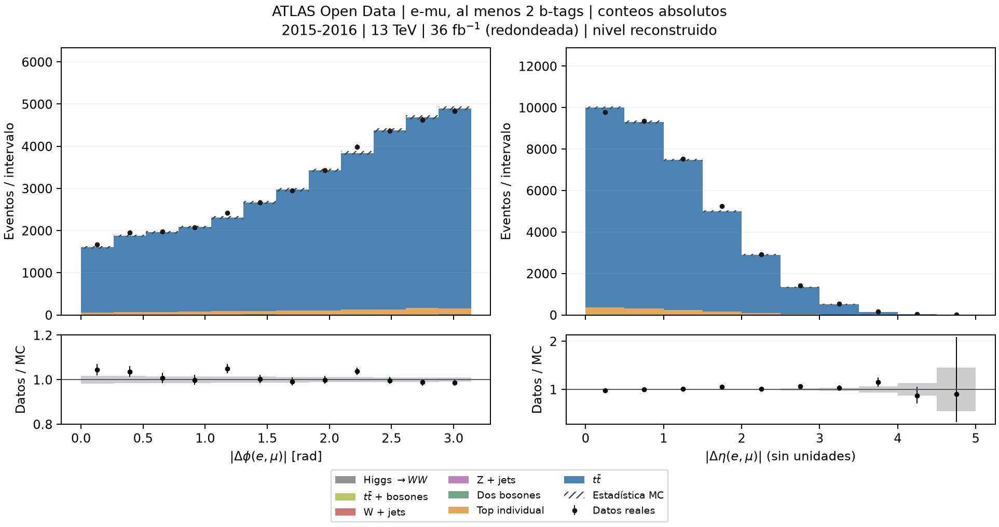

# ATLAS dilepton angular distributions
## Distribuciones angulares dileptónicas con ATLAS Open Data

A personal particle-physics data analysis project developed for **Laboratorio III**.
Proyecto personal de análisis de datos en física de partículas desarrollado para **Laboratorio III**.

## Scientific question / Pregunta científica

> To what extent are the observed Δφ(e,μ) and |Δη(e,μ)| distributions described
> by the simulated top-antitop signal and the available background processes?

> ¿En qué medida las distribuciones observadas de Δφ(e,μ) y |Δη(e,μ)| son
> descritas por la señal top-antitop simulada y los procesos de fondo disponibles?

*Collision data (black points) compared with the total Monte Carlo prediction.
Datos de colisiones (puntos negros) comparados con la predicción Monte Carlo total.*

## Data and analysis / Datos y análisis

The input consists of ATLAS Open Data proton-proton collisions from 2015-2016 at
√s = 13 TeV and the corresponding Monte Carlo samples. The educational
`2J2LMET30` ROOT ntuples contain reconstructed leptons, jets and missing
transverse momentum.

La selección principal requiere un electrón y un muón aceptados con cargas
opuestas y pT > 25 GeV, además de al menos dos jets aceptados y dos etiquetas b.
La predicción suma la señal top-antitop y los fondos simulados disponibles.

| Observables | Comparison / Comparación |
|---|---|
| Δφ(e,μ) and absolute Δη(e,μ) | Event yields, normalized shapes and data/MC ratios |

Monte Carlo events are weighted with the integrated luminosity, cross sections,
generator weights and available correction factors.

## Preliminary result / Resultado preliminar

| Collision data / Datos | Total MC | MC statistical uncertainty | Predicted tt̄ fraction |
|---:|---:|---:|---:|
| 36,945 | 36,691.3 | 131.9 | 96.57% |

The 96.57% value is the predicted top-antitop fraction within the total MC, not
a classification of individual collision events. Figures, numerical tables and
the explanation of the calculation are available in [results/](results/).

## Reproduce / Reproducir

With Python 3.12, from the repository root:

~~~text
python -m pip install -r requirements-lock.txt
python run.py check
python run.py plot
~~~

These commands test the code and regenerate the figures from the stored results
without downloading the ROOT files. To repeat the complete processing
(63 files, approximately 14.97 GB):

~~~text
python run.py download
python run.py check --with-data
python run.py analyze
~~~

The processing chain is:

~~~text
ROOT files → event selection → weights and observables
           → histograms → data/MC comparison
~~~

## Scope / Alcance

This is a reconstructed-level educational comparison. The current uncertainty
bands are statistical. A complete evaluation of systematic uncertainties and
non-prompt or misidentified-lepton backgrounds is pending, and no correction for
detector acceptance and resolution has been applied.

Es un análisis preliminar con objetos reconstruidos. Sus resultados no deben
interpretarse como una medición de precisión ni como un resultado oficial de ATLAS.

## Data and credit / Datos y créditos

- [Collision data — DOI 10.7483/OPENDATA.ATLAS.0CJR.N7ZT](https://doi.org/10.7483/OPENDATA.ATLAS.0CJR.N7ZT)
- [Monte Carlo simulation — DOI 10.7483/OPENDATA.ATLAS.NNF8.76IX](https://doi.org/10.7483/OPENDATA.ATLAS.NNF8.76IX)
- [ATLAS Open Data documentation](https://opendata.atlas.cern/docs/data/for_education/13TeV25_details)
- [Educational TTbarDilepAnalysis reference](https://github.com/atlas-outreach-data-tools/atlas-outreach-cpp-framework-13tev/tree/ff71d6ba82f2afd5a45d2e9b7f80bf915ceb1c84/Analysis/TTbarDilepAnalysis)

The ROOT files remain hosted by CERN. Their paths and checksums are recorded in
[analysis/manifest.json](analysis/manifest.json). Neither ATLAS nor CERN endorses
this analysis. The preliminary implementation was developed with AI assistance
and remains subject to the author's scientific review.
